<p align="center">
  
</p>

<p align="center">
  <a href="LICENSE"></a>
  
  
  
  
</p>

# MyraCrawl — website scraping POC

MyraCrawl crawls a website, extracts every page as clean markdown, builds a
profile of the company behind it (services, people, contact details), and serves
the results through a REST API and a small web UI.

This is the crawling slice of `myra-ai-engine` only — there are no embeddings, no
Qdrant, no RAG and no auth. The Next.js app talks to FastAPI directly.

## Contents

- [Screenshots](#screenshots)
- [Architecture](#architecture)
- [Prerequisites](#prerequisites)
- [Setup](#setup)
- [Running](#running)
- [Configuration](#configuration)
- [API](#api)
- [Where the data goes](#where-the-data-goes)
- [Crawl options](#crawl-options)
- [Pause, resume and cancel](#pause-resume-and-cancel)
- [What gets extracted, and how](#what-gets-extracted-and-how)
- [How the crawl behaves](#how-the-crawl-behaves)
- [Tests](#tests)
- [Project layout](#project-layout)
- [Troubleshooting](#troubleshooting)
- [Known limits](#known-limits)
- [License](#license)

## Screenshots

Enter a URL and start a crawl. While the job runs, the status card shows a live
elapsed timer and a page counter that moves as pages land.

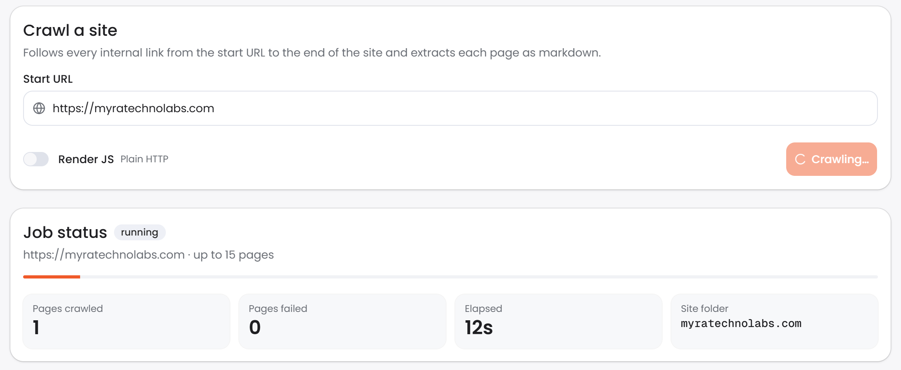

When the crawl finishes, the **JSONL** and **CSV** download buttons appear, along
with the site profile the crawl built and the full results table.

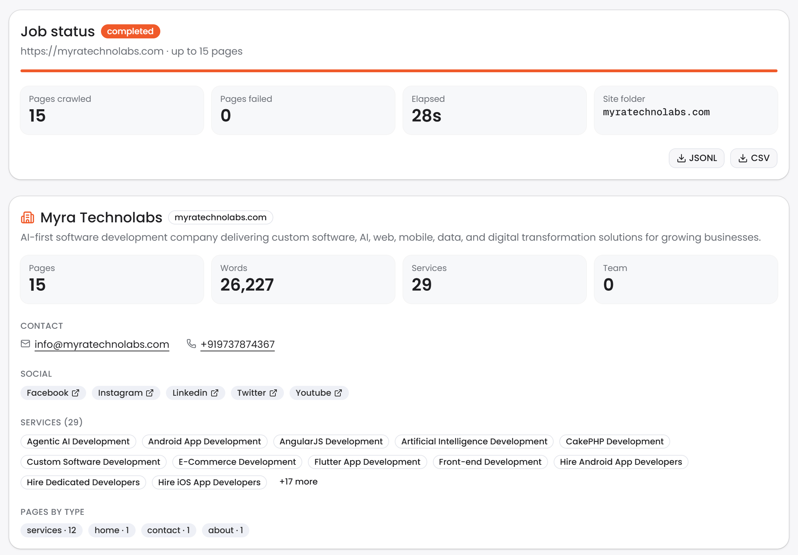

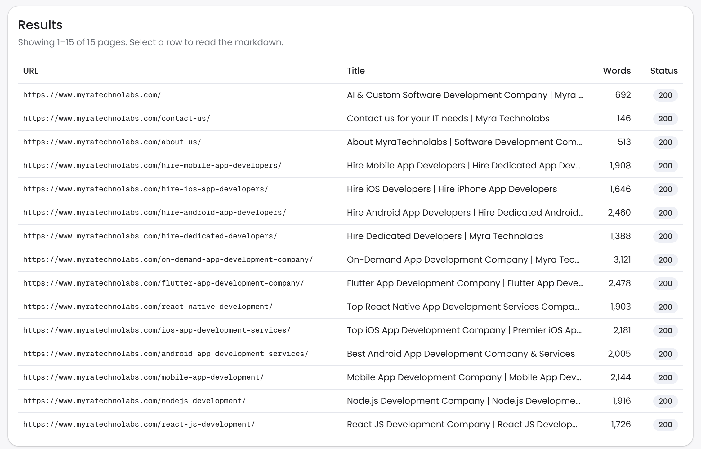

Select a row to read the extracted markdown for that page.

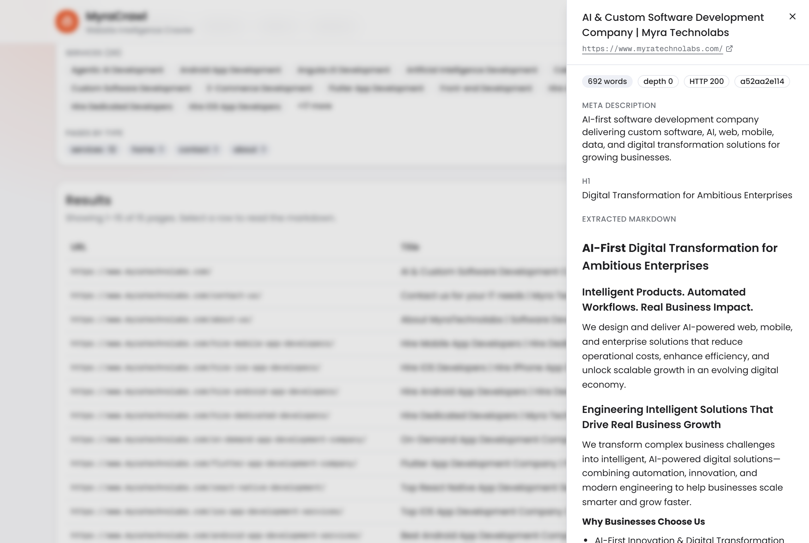

### Crawled sites

Every site MyraCrawl has crawled is listed under **Crawled sites** in the header
(`/sites`), most recently crawled first, with its latest crawl's status, page
count and age.

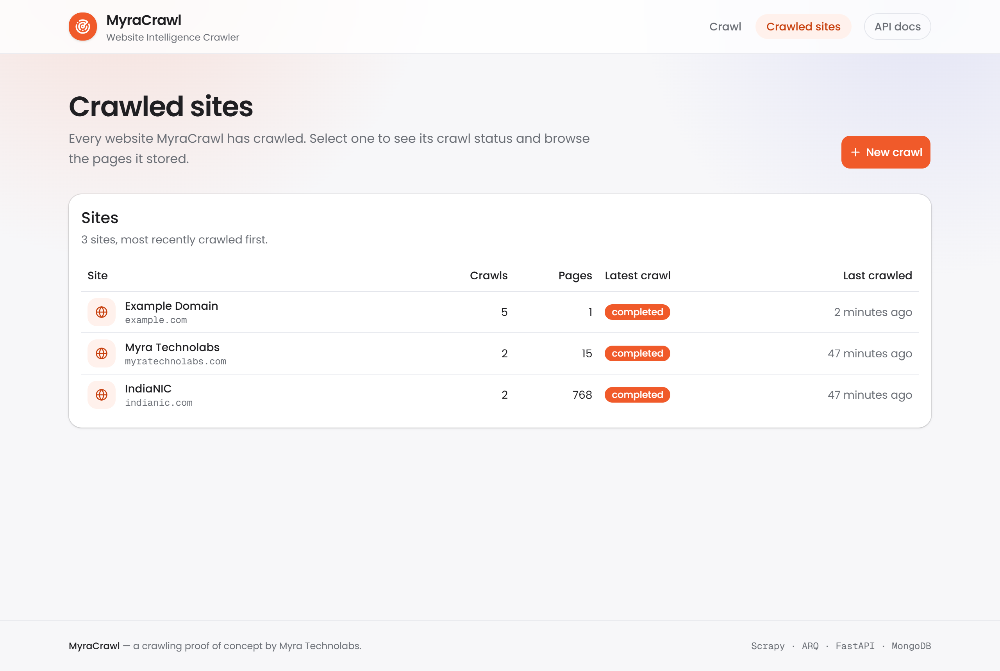

Select a site to open `/sites/{domain}`. It shows the same job status stats as a
live crawl, the site profile, and the full paginated **Results** for that crawl.
When a site has been crawled more than once, each crawl is one click away, and
`?job=<id>` in the URL links straight to a particular one.

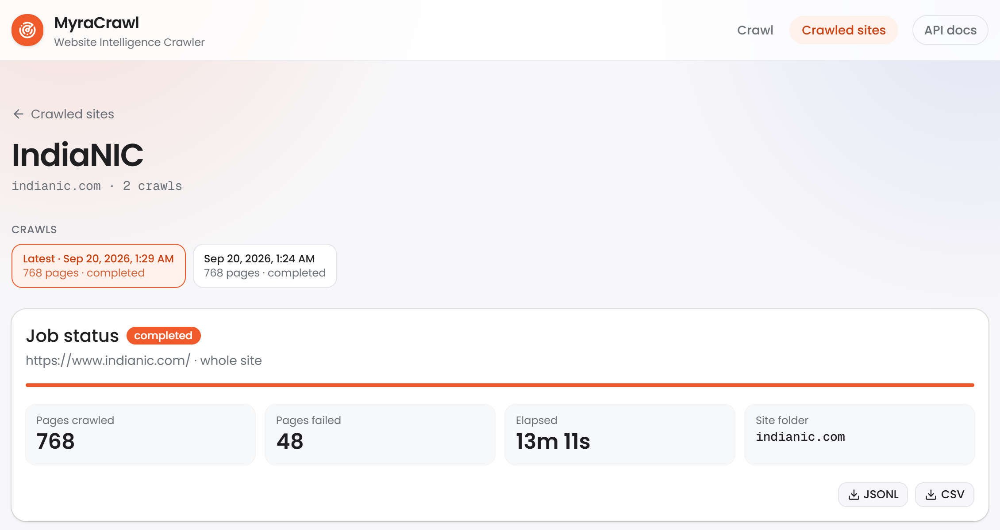

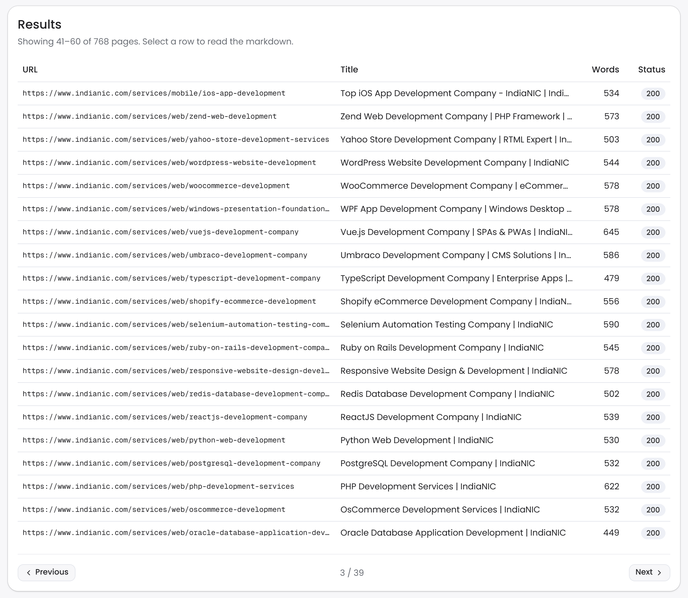

<details>
<summary>Start page</summary>

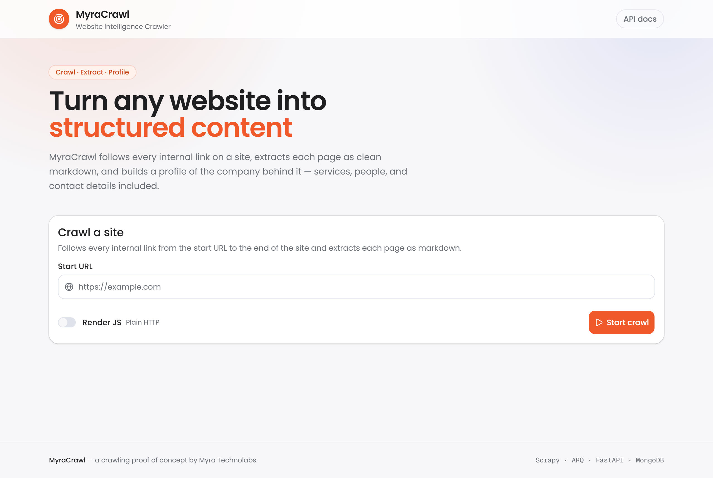

</details>

## Architecture

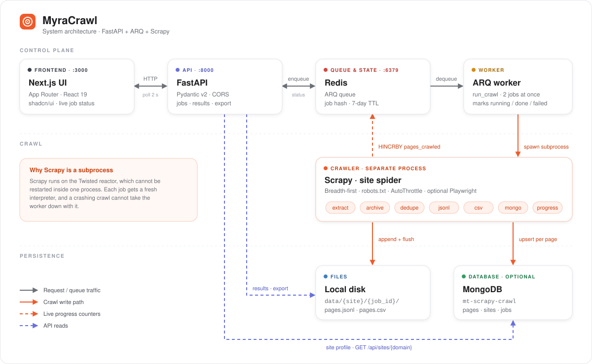

| Component | Role |
| --- | --- |
| **Next.js UI** (`:3000`) | Start a crawl, poll job status every 2 s, browse results and the site profile, download exports |
| **FastAPI** (`:8000`) | Validates requests, enqueues jobs, and serves job status, results, exports and site profiles |
| **Redis** (`:6379`) | The ARQ job queue, plus one hash per job holding its status and live counters (7-day TTL) |
| **ARQ worker** | Picks up `run_crawl`, launches Scrapy, and marks the job running / completed / failed |
| **Scrapy** | Crawls the site and runs each page through the item pipelines |
| **Local disk** | `pages.jsonl` and `pages.csv` per job — the source of truth for results and exports |
| **MongoDB** (optional) | Queryable `pages`, `sites` and `jobs` collections that accumulate across crawls |

Scrapy runs as a **subprocess**, not inside the worker: the Twisted reactor is
not restartable, so a second in-process crawl would fail. A subprocess also keeps
a crashing crawl from taking the worker down.

### The crawl pipeline

Every HTML page becomes one `PageItem`, which passes through seven Scrapy item
pipelines in order. The first three can drop it; the last four write it out.

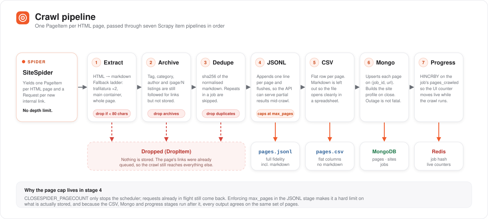

## Prerequisites

- Python 3.11+
- [uv](https://docs.astral.sh/uv/) — `curl -LsSf https://astral.sh/uv/install.sh | sh`
  (Windows: `powershell -c "irm https://astral.sh/uv/install.ps1 | iex"`)
- Node.js 20+
- Redis 7+, via Docker or locally
- MongoDB 7+ reachable at `MONGO_URL` (optional — see `MONGO_ENABLED`)

## Setup

### 1. Redis and MongoDB

```bash
cd scraper-poc
docker compose up -d
```

No Docker? Any local Redis works — `brew install redis && brew services start redis`
on macOS, or a Redis for Windows build. Point `REDIS_URL` at whichever you use.

MongoDB is not in the compose file — it is expected to already exist at
`MONGO_URL`. Set `MONGO_ENABLED=false` to run without it.

### 2. Backend

```bash
cd backend
cp .env.example .env                 # PowerShell: Copy-Item .env.example .env
uv sync
uv run playwright install chromium   # only needed for "Render JS" crawls
```

### 3. Frontend

```bash
cd frontend
cp .env.example .env.local           # PowerShell: Copy-Item .env.example .env.local
npm install
```

## Running

Three processes, one per terminal, all from `scraper-poc/`:

```bash
# API      → http://localhost:8000  (docs at /docs)
cd backend && uv run uvicorn app.main:app --reload --port 8000

# Worker   — required: without it every job stays "queued"
cd backend && uv run arq worker.worker.WorkerSettings

# UI       → http://localhost:3000
cd frontend && npm run dev
```

Open <http://localhost:3000>, enter a URL, and start a crawl.

- The status card polls every 2 s. **Pages crawled** and **Pages failed** update
  on each poll, and **Elapsed** ticks every second while the job runs.
- **JSONL** and **CSV** downloads, the results table and the site profile card
  appear once the job has finished, so the files you download are complete.
- Click a row for the markdown preview.

The home page tracks the job you started in the current tab. Refreshing it
starts from a blank state, but the job keeps running and is always reachable
from **Crawled sites** (`/sites`), which lists every crawl found on disk — also
the ones from earlier sessions.

## Configuration

`backend/.env` (see `backend/.env.example`):

| Variable | Default | Notes |
| --- | --- | --- |
| `REDIS_URL` | `redis://localhost:6379/0` | Job status and the ARQ queue |
| `MONGO_URL` | `mongodb://192.168.0.102:27017/` | Where pages/sites/jobs are stored |
| `MONGO_DB` | `mt-scrapy-crawl` | Database name |
| `MONGO_ENABLED` | `true` | `false` runs file-only, no database |
| `CORS_ORIGINS` | `["http://localhost:3000"]` | JSON array of allowed origins |
| `DEFAULT_MAX_PAGES` | `0` | `0` crawls the whole site; a positive value caps it |
| `CRAWL_PAGE_CEILING` | `10000` | Backstop against crawl traps, applied even at `0` |
| `STORE_ARCHIVE_PAGES` | `false` | Keep tag/category/pagination listings |
| `JOB_TIMEOUT_SECONDS` | `3600` | ARQ job timeout — whole-site crawls are slow |
| `PAUSE_GRACE_SECONDS` | `30` | How long a paused crawl gets to flush its queue before it is killed |
| `PAUSE_GRACE_SECONDS_JS` | `180` | The same for a Render JS crawl, which shuts down far more slowly |
| `SCRAPY_LOG_LEVEL` | `INFO` | |
| `HTTPCACHE_ENABLED` | `false` | Turn on in dev to replay crawls from disk |
| `USER_AGENT` | `MyraCrawlPOC/0.1 …` | Sent on every request |

`frontend/.env.local` (see `frontend/.env.example`):

| Variable | Default |
| --- | --- |
| `NEXT_PUBLIC_API_URL` | `http://localhost:8000` |

The crawl target is never hardcoded — it comes from the form, the API body, or
`--url` on the smoke test.

## API

Interactive docs are served at <http://localhost:8000/docs>.

| Method | Path | Description |
| --- | --- | --- |
| `POST` | `/api/crawl` | `{url, max_pages?, use_js?, use_sitemap?, download_files?, extract_contacts?}` → `{job_id}` (202). `max_pages` defaults to 0 = whole site |
| `GET` | `/api/jobs/{job_id}` | Status, counts, timestamps, error, pause/resume state |
| `POST` | `/api/jobs/{job_id}/pause` | Stop a `running` crawl, keeping its place. 409 from any other state |
| `POST` | `/api/jobs/{job_id}/resume` | Re-queue a `paused` crawl against the same jobdir. 409 otherwise |
| `POST` | `/api/jobs/{job_id}/cancel` | Stop for good, keeping partial output. Valid from `running`, `pausing` or `paused` |
| `GET` | `/api/jobs/{job_id}/stats` | Page/document counts, schema types, average response time |
| `GET` | `/api/jobs/{job_id}/documents?include_text=false` | Downloaded documents and their extracted text |
| `GET` | `/api/jobs/{job_id}/results?page=1&size=20` | Paginated summaries, no markdown |
| `GET` | `/api/jobs/{job_id}/results/{index}` | One page including markdown |
| `GET` | `/api/jobs/{job_id}/export?format=jsonl\|csv` | Downloads the JSONL or CSV |
| `GET` | `/api/jobs/{job_id}/site` | The site profile for this job's website |
| `GET` | `/api/sites` | Every crawled website with its latest crawl, most recent first |
| `GET` | `/api/sites/{domain}/jobs` | Every crawl of one website, newest first |
| `GET` | `/api/sites/{domain}` | The site profile by domain (needs MongoDB) |
| `GET` | `/health` | Liveness |

### Job status

```
queued → running → completed | failed
            ↕
      pausing → paused → resuming → running
            ↘         ↘
          cancelled  cancelled
```

`pausing` and `resuming` are the in-between states: the API has accepted the
request and the worker has not finished acting on it yet. `completed`, `failed`
and `cancelled` are terminal — the UI stops polling there. A `paused` job is not
terminal; nothing moves until someone resumes or cancels it.

An invalid transition is a **409** naming the state the job is actually in, e.g.
`Job is completed; only a running job can be paused.`

`/api/sites` and `/api/sites/{domain}/jobs` are built from `backend/data/`, so
they need neither MongoDB nor a live Redis record. A job whose Redis record has
expired is still served by every `/api/jobs/{job_id}` route from its files; see
[Known limits](#known-limits) for what that fallback cannot recover.

```bash
curl -X POST localhost:8000/api/crawl \
  -H 'content-type: application/json' \
  -d '{"url":"https://myratechnolabs.com/"}'

# then, once it finishes
curl localhost:8000/api/sites/myratechnolabs.com | jq '{name, services_count, emails, phones}'
```

## Where the data goes

Three destinations, written by the Scrapy pipelines in order.

### 1. `pages.jsonl` — one file per job, full fidelity

`backend/data/{site}/{job_id}/pages.jsonl`. The site folder comes from the start
URL's domain, so every crawl of a site collects under one folder:

```
backend/data/
└── multiqos.com/
    └── bea06cf36a8c4b0e8721ed0589713b88/
        ├── pages.jsonl        # one JSON object per crawled page (appended)
        ├── pages.csv          # the same rows, flattened, no markdown
        ├── documents.jsonl    # downloaded files + extracted text (download_files)
        ├── files/             # the downloaded files themselves
        └── jobdir/            # Scrapy's saved queue; only while paused
```

`jobdir/` exists only between a pause and a resume — it is removed when the job
completes or is cancelled. `documents.jsonl` and `files/` appear only for a job
that ran with `download_files`.

One JSON object per line:

```json
{
  "url": "https://multiqos.com/",
  "status_code": 200,
  "depth": 0,
  "title": "Agentic AI, Data Engineering & Software Development | MultiQoS",
  "meta_description": "MultiQoS combines AI automation, modern data engineering…",
  "h1": "Upgrade Your Website Without Coding",
  "markdown": "# Agentic AI…",
  "word_count": 929,
  "content_hash": "49308700…",
  "crawled_at": "2026-09-19T12:38:10.114+00:00",
  "page_type": "home",
  "canonical_url": "https://multiqos.com/",
  "lang": "en",
  "og_image": "https://…/og-home.jpg",
  "links_internal": 207,
  "links_external": 8,
  "images": 82
}
```

### 2. `pages.csv` — same rows, spreadsheet-shaped

Alongside the JSONL, with the columns in `crawler/items.py::CSV_COLUMNS`.
**Markdown is deliberately not a column**: multi-KB cells make a CSV unusable in
a spreadsheet, and the JSONL already carries the full text. Newlines inside a
cell are flattened so naive readers do not mis-split rows.

### 3. MongoDB — queryable, cumulative across jobs

Database `mt-scrapy-crawl` (`MONGO_URL`, `MONGO_DB`), three collections:

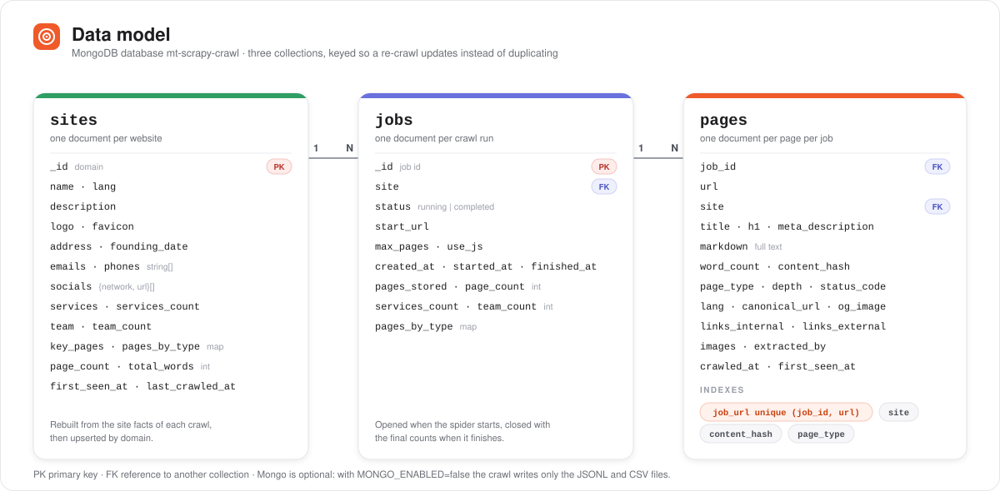

| Collection | Key | Contents |
| --- | --- | --- |
| `pages` | `(job_id, url)` unique | Every crawled page, markdown included, one doc per page per job |
| `sites` | `_id` = domain | One profile per website, rebuilt on each crawl |
| `jobs` | `_id` = job id | Crawl parameters, status, final counts, page-type breakdown |

A `sites` document is what the crawl *learned about the company*, merged across
the homepage, about page and contact page:

```json
{
  "_id": "multiqos.com",
  "name": "MultiQoS",
  "description": "MultiQoS combines AI automation, modern data engineering…",
  "logo": "https://…/og-home.jpg",
  "favicon": "https://multiqos.com/favicon.ico",
  "lang": "en",
  "emails": ["biz@multiqos.com"],
  "phones": ["+12242102056", "+918866687330"],
  "socials": [{"network": "linkedin", "url": "https://www.linkedin.com/company/multiqos/"}],
  "services": [{"name": "AI Agent Development", "url": "https://multiqos.com/ai-agent-development-services"}],
  "services_count": 88,
  "team": [], "team_count": 0,
  "key_pages": {"about": "https://multiqos.com/about-us/", "contact": "https://multiqos.com/contact-us/"},
  "page_count": 20, "total_words": 23867,
  "pages_by_type": {"home": 1, "about": 1, "contact": 1, "services": 17}
}
```

Mongo being unreachable is **not** fatal: the crawl logs the error and finishes
with the JSONL and CSV intact. Set `MONGO_ENABLED=false` to skip it entirely.

## Crawl options

Four switches on the crawl form, all off by default and all accepted by
`POST /api/crawl`:

| Flag | What it does |
| --- | --- |
| `use_js` | Renders the page with Playwright first. Slower, and needed for sites that return 403 to a plain HTTP client |
| `use_sitemap` | Seeds the frontier from the site's own sitemap — `robots.txt` first, then the well-known paths — instead of following links. Falls back to link-following when no usable sitemap exists |
| `download_files` | Fetches linked `pdf`/`docx`/`xlsx`/`pptx` and extracts their text into `documents.jsonl`. Capped at 50 files and 20 MB each |
| `extract_contacts` | Collects emails, phones, social profiles and postal addresses. **Off by default on purpose — see below** |

### Personal data

`extract_contacts` collects **personal data**, which is regulated under the
**GDPR** (EU/UK) and India's **DPDP Act**. Turning it on makes you responsible
for having a lawful basis to collect it, for storing only what you actually
need, and for deleting it when that purpose ends.

The crawler takes two deliberate positions here:

- It is **opt-in per job**. A crawl that does not ask for contacts stores none,
  and the fields stay empty on every page record.
- **Addresses come from declared JSON-LD `PostalAddress` only** — never from a
  regex over the page text. An address-shaped regex produces a stream of false
  positives, and every false positive is personal data you did not need and
  cannot justify holding.

Contacts are written to `pages.jsonl` and to MongoDB like any other field, so a
deletion request means deleting the job folder and the matching Mongo documents.

## Pause, resume and cancel

A running crawl can be paused and picked up later from exactly where it stopped.

Scrapy is given a `JOBDIR` (`data/{site}/{job_id}/jobdir`), where it persists its
pending request queue, the seen-URL set and the spider state. The mechanics:

- **Pause** is a *graceful* shutdown, not a kill. Scrapy only writes its queue to
  `JOBDIR` while closing cleanly, so the worker signals it and waits — `SIGTERM`
  on POSIX, and on Windows a `CTRL_BREAK_EVENT` to the child's own process group,
  which arrives as `SIGBREAK` (a signal Scrapy handles alongside `SIGTERM`).
  `Popen.terminate()` is deliberately **not** used on Windows: it maps to
  `TerminateProcess`, the equivalent of `SIGKILL`, and skips the flush entirely.
- After the grace period (`PAUSE_GRACE_SECONDS`, or `PAUSE_GRACE_SECONDS_JS` for
  a Render JS crawl) the process is killed as a last resort. A killed pause is
  logged as a warning, because the frontier it leaves behind may be incomplete.
- **Resume** re-queues the same job against the same jobdir, which is never
  cleared. The worker logs how many requests it picked up.
- **Cancel** stops the crawl and deletes the jobdir. Partial output stays exactly
  where it is and remains readable through the API.

Two things make a resume safe rather than merely possible:

- `pages.jsonl` is **appended**, never truncated, so a resumed run adds to the
  same file.
- `DedupePipeline` loads the content hashes already in `pages.jsonl` on startup,
  and `JsonLinesPipeline` counts the rows already there against `max_pages`.
  Without the first, a resume would re-emit every page the earlier run had
  queued but not finished; without the second, it would be granted a fresh
  allowance of `max_pages` on top of what it already had.

Why the API never signals the process itself: the worker is the only thing
holding the subprocess handle. `POST /api/jobs/{id}/pause` writes a request into
`job:{id}:control` in Redis, and the worker — which polls that key once a second
— is what acts on it.

## What gets extracted, and how

`crawler/extractors.py` runs heuristics over each page:

- **Page type** — `home`, `about`, `team`, `contact`, `careers`, `services`,
  `portfolio`, `blog`, `legal`, `pricing`, `other`, from the URL path first and
  the headings as a fallback.
- **Metadata** — canonical URL, `lang` (the page's own `<html lang>`, or
  detected with py3langid when it has none), Open Graph and Twitter tags as
  nested objects, `hreflang` alternates, favicon, robots directive.
- **Headings** — `[{level, text}]` for `h1`–`h3` in document order, so the
  outline survives extraction.
- **Structured data** — every `application/ld+json` block, flattened out of
  `@graph`, plus the `schema_types` found on the page. `FAQPage` questions
  become `faqs: [{question, answer}]` and `Product` blocks become
  `products: [{name, sku, price, currency, availability}]` — the two shapes a
  chatbot can answer from directly. Parsed with `extruct`; malformed JSON-LD
  never stops a crawl, and one broken block does not discard the good ones on
  the same page.
- **Links and media** — internal link count, external links with their anchor
  text, images (skipping `data:` URIs, tracking pixels and anything the markup
  declares smaller than 100px), videos from YouTube/Vimeo embeds and `<video>`,
  and document links by extension.
- **Technical** — status code, depth, redirect chain, response time, content
  type, page size, crawl timestamp.
- **Contacts** — emails and phones from `mailto:`/`tel:` links and page text,
  plus social profiles across 13 networks. Phone numbers are normalised and
  length-checked so tracking junk does not get through.
- **Services** — internal links whose URL looks like a service page
  (`/services/`, `/hire-…`, `…-development`, `…-solutions`), with the anchor
  text as the name.
- **Team** — schema.org `Person` blocks first, then repeated person cards in the
  markup (a name-shaped heading followed by a role-shaped line). A site that
  publishes no named people yields an empty list, which is the honest answer
  rather than noise.
- **Organisation** — `Organization`/`LocalBusiness` JSON-LD for legal name,
  address and founding date.

Site-level extraction only runs on pages that plausibly carry these facts
(`SITE_FACT_PAGE_TYPES`), so blog posts do not pay the cost.

The markdown itself comes from a fallback ladder in `crawler/content.py`:
Trafilatura in markdown mode, Trafilatura in text mode, the page's main
container, and finally the whole page. Trafilatura returns nothing at all on some
templates even when the article is plainly in the HTML, so the ladder keeps such
pages instead of losing them.

### Crawl scope

**There is no depth limit.** Every internal link is followed until the site runs
out of them; `depth` is recorded on each page as information only. A crawl of
myratechnolabs.com reaches depth 6, and one of multiqos.com reaches depth 38.

`max_pages` defaults to `0`, meaning the whole site. `CRAWL_PAGE_CEILING`
(10,000) still applies as a backstop so a crawl trap cannot run forever. The web
form always crawls the whole site; use the API (or the smoke test) to set a cap.

**Archive listings are followed but not stored.** `/tag/…`, `/category/…`,
`/author/…`, `/page/2/` and friends exist to link to posts, not to be read. On
myratechnolabs.com they were 350 of 495 responses; storing them buried the real
content and, because they all render near-identical excerpt lists, they poisoned
the dedupe set. Set `STORE_ARCHIVE_PAGES=true` to keep them.

Links are queued with a priority derived from their page type
(`PAGE_TYPE_PRIORITY`): team and about/contact rank highest, services next, blog
posts low, archives lowest.

## How the crawl behaves

- **robots.txt is obeyed** (`ROBOTSTXT_OBEY=True`). Disallowed URLs count as
  failures, which is why `pages_failed` is usually non-zero on a real site.
- **Internal links only.** `allowed_domains` is derived from the start URL with
  `www.` stripped, so subdomains (`help.`, `de.`) are treated as internal —
  standard Scrapy semantics.
- **Assets are skipped** at link-extraction time (pdf, images, archives, css, js,
  fonts, feeds), along with `mailto:`, `tel:`, `javascript:` and bare fragments.
- **URLs are normalised** — fragment dropped, query parameters ordered — so
  `/a#one` and `/a#two` are one page.
- **`max_pages` is a hard cap.** `CLOSESPIDER_PAGECOUNT` only stops the
  scheduler, and requests already in flight still return, so the JSONL pipeline
  enforces the limit on what actually gets stored.
- **Duplicate content is dropped** by sha256 of the markdown, within a job.
- **Throttling**: `AUTOTHROTTLE_ENABLED`, 4 concurrent requests per domain,
  0.5 s delay, 2 retries.

`use_js` routes requests through scrapy-playwright. The handler is registered
always but defers to the plain HTTP handler unless a request carries
`meta={"playwright": True}`, so non-JS crawls never launch a browser and work
fine without one installed. JS crawls do need it: run
`uv run playwright install chromium` once (see [Setup](#setup)).

On Windows scrapy-playwright runs Playwright on its own event loop in a
background thread. Its shutdown leaves cancelled-task errors in the log on every
crawl, so `crawler/playwright_shutdown.py` replaces that one method with a clean
version. Delete the module and its call in `crawler/settings.py` once upstream
fixes it; a test reports when that happens.

## Tests

```bash
cd backend
uv run pytest                 # 183 tests
```

Covers the pipelines (`ExtractPipeline`, `ArchivePipeline`, `DedupePipeline`,
`CsvPipeline`, the `max_pages` cap, markdown normalisation), the extraction
fallback ladder, the spider (URL normalisation, link filtering, no depth limit,
crawl priority, structured fields), the extractors (page classification,
contacts, phone normalisation, services, team from both JSON-LD and markup,
organisation, and the site profile merge), and the on-disk catalog behind the
sites pages (scanning, path-traversal rejection, stats from CSV or JSONL, and
the routes' fallback for jobs Redis has forgotten), how a failed crawl is
reported (a missing Playwright browser is named, and the message keeps its
first line), and a clean shutdown of scrapy-playwright's loop thread.

The frontend is checked with `npm run lint` and `npx tsc --noEmit`.

### Smoke test

Needs the API **and the worker** running.

```bash
cd backend
uv run python scripts/smoke_test.py --url https://myratechnolabs.com/ --max-pages 0
uv run python scripts/smoke_test.py --url https://example.com --max-pages 10 --min-pages 1
uv run python scripts/smoke_test.py --use-js                 # via Playwright
```

It posts a crawl, polls to completion, then asserts that the job completed, the
page count is at least `--min-pages` (default 10) and within `--max-pages`, every
content hash is unique, every page has words and non-empty markdown, and the
JSONL export matches the results count. It finishes by printing a summary table.

## Project layout

```
scraper-poc/
├── LICENSE                     # MIT
├── docker-compose.yml          # redis only
├── docs/images/                # README diagrams and screenshots
├── backend/
│   ├── app/                    # FastAPI: main, api/routes, schemas, config,
│   │                           #   job_store (Redis), mongo (reads), urls,
│   │                           #   catalog (scans data/ for the sites pages)
│   ├── worker/                 # ARQ: WorkerSettings, run_crawl, failure (readable errors),
│   │                           #   control (graceful stop, cross-platform signals)
│   ├── crawler/                # Scrapy: spiders/site_spider, pipelines, items,
│   │                           #   content (extraction ladder), extractors,
│   │                           #   structured (JSON-LD/FAQ/Product via extruct),
│   │                           #   seo (headings, meta, language), assets (links,
│   │                           #   images, videos, document links),
│   │                           #   documents (file download + text extraction),
│   │                           #   sitemap (discovery and parsing),
│   │                           #   site_profile, mongo_store, settings,
│   │                           #   playwright_shutdown (quiet loop-thread exit)
│   ├── scripts/smoke_test.py
│   ├── data/{site}/{job_id}/   # pages.jsonl + pages.csv
│   └── tests/
└── frontend/                   # Next.js App Router + shadcn/ui
    └── src/
        ├── app/page.tsx        # home: start a crawl and follow it live
        ├── app/sites/          # /sites (crawled sites) and /sites/[domain]
        ├── components/         # crawl-form, job-status-card, job-results,
        │                       #   results-table, page-detail-sheet, sites-table,
        │                       #   crawl-history, site-profile-card, site-header
        └── lib/                # api.ts (typed client), use-job-polling, format
```

## Troubleshooting

**The job stays on "queued" and nothing crawls.** The ARQ worker is not running.
The API only enqueues the job; the worker is what runs it. Start it with
`uv run arq worker.worker.WorkerSettings` from `backend/`. The status card shows
a hint after 15 s in the queue.

**The job says "running" but the counters never move.** The worker was probably
stopped mid-crawl. Its Redis record stays `running` until the 7-day TTL expires;
start a new crawl.

**"Cannot reach the API at http://localhost:8000".** The API is not running, or
`NEXT_PUBLIC_API_URL` points somewhere else. If the browser reports a CORS error
instead, add the UI's origin to `CORS_ORIGINS`.

**A Render JS crawl fails at once with "Crawl produced no pages".** Playwright's
browser was never downloaded, so every JS request fails. The job's error leads
with the fix: run `uv run playwright install chromium` in `backend/` once, then
start the crawl again. Plain crawls never need it. The worker does not need a
restart, since each crawl is a fresh Scrapy process.

**A new page or endpoint returns 404 (for example `/api/sites`).** The API process
is still running old code. Restart `uvicorn`; on Windows, `--reload` can miss a
change, and a second `uvicorn` left running on the same port can keep answering.

**"Crawl produced no pages".** The crawl exited cleanly but stored nothing: the
site blocked the user agent, `robots.txt` disallows the start URL, or every page
extracted empty. The error on the job carries the tail of Scrapy's log.

**Mongo warnings in the worker log.** Expected if MongoDB is unreachable. The
crawl still completes with the JSONL and CSV; set `MONGO_ENABLED=false` to
silence them.

## Known limits

This is a POC, so a few things are deliberately simple:

- The API's results endpoints scan the JSONL file per request rather than
  querying Mongo. Fine for hundreds of pages, not for hundreds of thousands —
  the `pages` collection is already indexed for it when that matters.
- Job records live in Redis with a 7-day TTL; the files and Mongo documents are
  never cleaned up. Once a record expires, the API rebuilds the job from its
  files (and the Mongo `jobs` document, when Mongo is up), so results, exports
  and the sites pages keep working. Two things cannot be recovered: how many
  requests failed (`pages_failed` reads 0), and whether a crawl that stored pages
  was interrupted — it is reported as completed. Without Mongo the page cap and
  JS setting of an old crawl are unknown too.
- Nothing detects a worker that died mid-crawl, so that job stays `running`.
- Team extraction is heuristic. It reads schema.org reliably and common card
  markup well, but an unusual layout will yield nothing rather than guess.
- A whole-site crawl of a large blog takes minutes and hits the site a few
  times a second. `AUTOTHROTTLE` and `DOWNLOAD_DELAY` keep it polite, but it is
  not a background task you should fire off casually at someone else's site.
- There is no auth, no rate limiting and no per-tenant isolation.
- Cancelling a running job is not implemented.

## License

Released under the [MIT License](LICENSE). Copyright © 2026 Myra Technolabs.

Third-party dependencies are covered by their own licenses.
